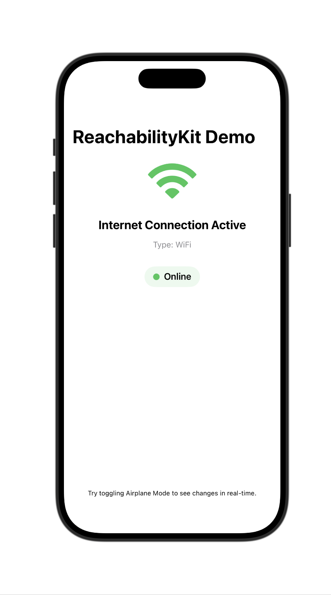

# ReachabilityKit

A lightweight, native, and zero-boilerplate network monitor for SwiftUI. Observe connectivity status and interface types (WiFi, Cellular, etc.) in real-time.



## Features
- **Native Implementation**: Built entirely using `NWPathMonitor` from Apple's Network framework.
- **Zero Boilerplate**: Access connectivity via the `Reachability.shared` singleton.
- **SwiftUI Integration**: First-class support for SwiftUI with `@StateObject` and view modifiers.
- **Detailed Status**: Identify whether the user is on **WiFi**, **Cellular**, or **Wired** connection.
- **Low Energy**: Optimized for power efficiency by following best practices for network monitoring.

## Supported Platforms
- iOS 14.0+
- macOS 11.0+

## Installation

```swift
.package(url: "https://github.com/ErsanQ/ReachabilityKit", from: "1.0.0")
```

## Usage

### Simple Observer
```swift
import SwiftUI
import ReachabilityKit

struct MyView: View {
    @StateObject private var network = Reachability.shared
    
    var body: some View {
        if network.isConnected {
            Text("Connected via \(network.connectionType.rawValue)")
        } else {
            Text("Offline Mode")
        }
    }
}
```

### View Modifier
```swift
Text("App Content")
    .onNetworkChange { isConnected in
        if !isConnected {
            print("Connectivity lost!")
        }
    }
```

## License
MIT License.

## Author
ErsanQ (Swift Package Index Community)
